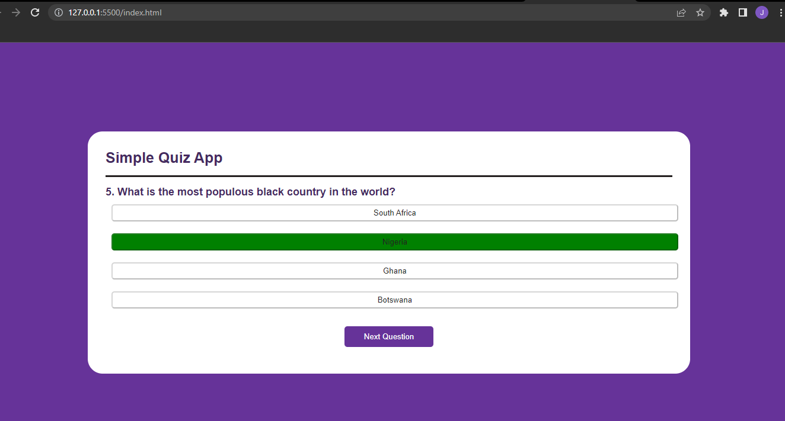
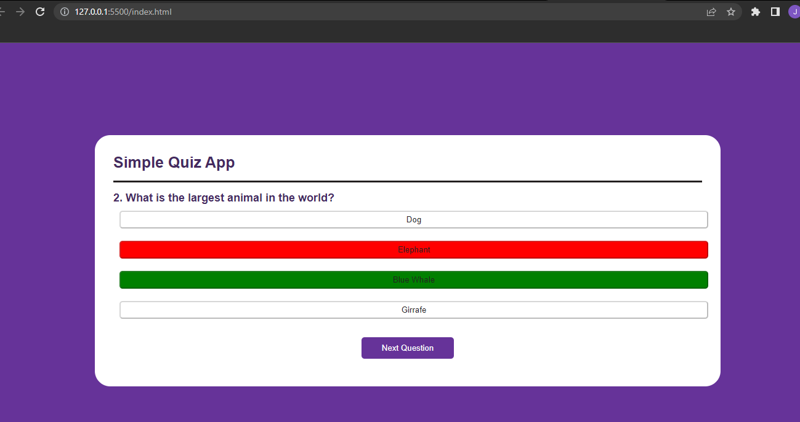
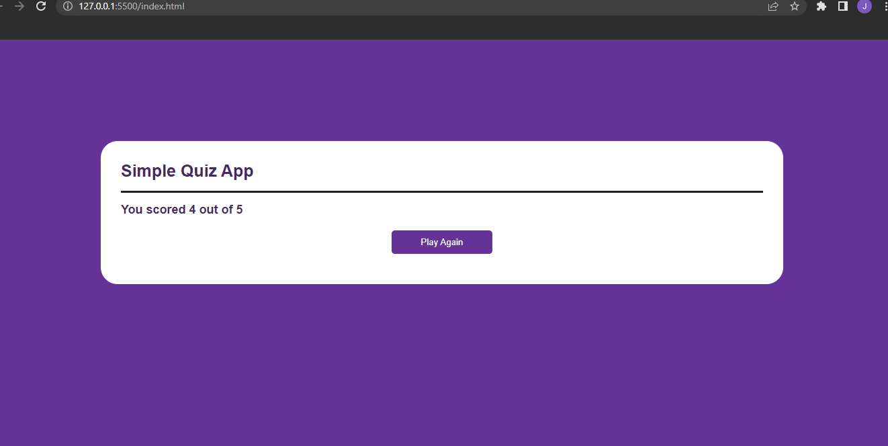

## Description

This is the second project in the 40 projects for web developers series which involves building a quiz app

## Requirements

This application was built using html, css and javascript.

The reason for this choice was the fact that i have not written html and css in a while and wanted to brush up on it.

## Images

### Correct answer screenshot

### Wrong answer screenshot

### Scores screenshot

## Possible Areas of Improvement

- Increasing the number of quiz questions.
- Creating a backend to enable addition and storage of questions on a database.
- Randomizing the questions for the user.
